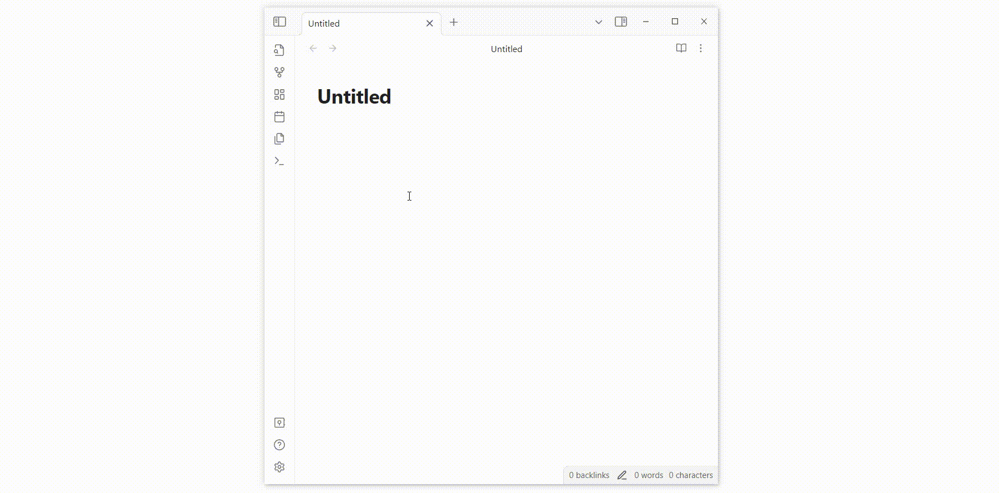

# Obsidian Expand Out

When you click the Expand/Collapse button in the left top or right top, the split leaf will expand/collapse inside the obsidian workspace. It could affect the middle leaf. This plugin alters the default behavior, allowing the split leafs to expand/collapse outward.

> The GIF looks a bit choppy because it was converted from an MP4.